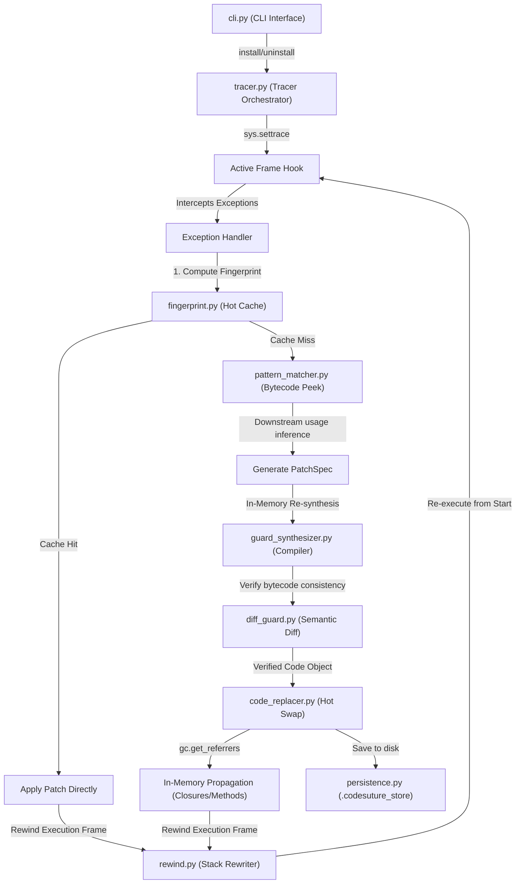
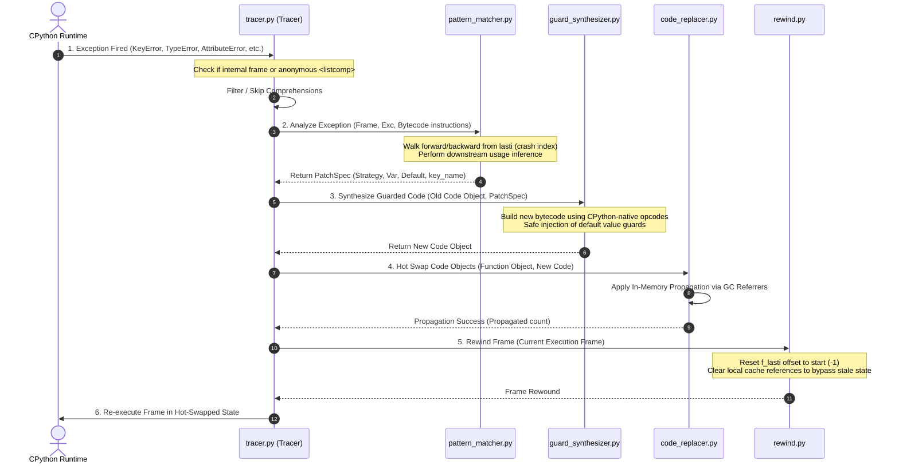

# CodeSuture v0.5.1: Technical Architecture & Execution Map

Welcome to the definitive blueprints of **CodeSuture v0.5.1**. This document maps out the system components, data flows, bytecode manipulation pipelines, self-healing mechanisms, and runtime control flows that orchestrate the automatic detection, patching, and seamless recovery of Python applications.

---

## 1. Visual System Architecture Graph

Here is the high-fidelity node visualization of the CodeSuture runtime self-healing pipeline:

---

## 2. Dynamic Execution Flow

The core of CodeSuture operates as an out-of-band active supervisor that dynamically modifies CPython bytecode inside runtime frames using lower-level hooks, frame reconstruction, and garbage collection tracking.

---

## 3. Dynamic Exception Hot-Patching Lifecycle

When an unhandled exception fires, CodeSuture intercepts the crash before it unwinds the call stack, patches the code object in-place, propagates it through memory references, rewinds the current execution frame, and immediately re-executes the block.

---

## 4. Directory & File Reference Map

Below is a complete, structural breakdown of the `codesuture` package source code.

| Component / File | Primary Functions & Classes | Key Architectural Responsibility | Design Constraints & Notes |
| :--- | :--- | :--- | :--- |
| [`tracer.py`](file:///c:/Users/Star/Documents/codesuture/codesuture/tracer.py) | `CodeSutureTracer` `install()` / `uninstall()` | Primary trace loop. Coordinates settrace hooks, filters internal frames, deduplicates exceptions, self-heals engine bugs, and coordinates rollback requests. | *Must not hook internal tracer frames to prevent infinite execution loops.* |
| [`pattern_matcher.py`](file:///c:/Users/Star/Documents/codesuture/codesuture/pattern_matcher.py) | `analyze_exception()` `_infer_subscript_default()` | Bytecode crawler. Examines current frame state, searches backward for local identifiers, crawls forward through `LOAD_ATTR`/`LOAD_METHOD` to determine type-correct defaults. | *Peeks up to 3 instructions past subscripts to distinguish `""`, `0`, or `None` downstream.* |
| [`guard_synthesizer.py`](file:///c:/Users/Star/Documents/codesuture/codesuture/guard_synthesizer.py) | `synthesize_guarded_code()` `propagate_patch()` | Dynamic code compiler. Generates new bytecode nodes, injects safety guards/default fallbacks, and executes selective patch propagation using garbage collection referrers. | *Bypasses comprehensions (`<listcomp>`, `<genexpr>`) safely without crashing.* |
| [`code_replacer.py`](file:///c:/Users/Star/Documents/codesuture/codesuture/code_replacer.py) | `replace_function_code()` `get_function_from_frame()` | Memory state resolution. Resolves active function objects, closures, properties, or class methods from stack frames to perform the core in-memory swap. | *Must be robust to decorators, wrappers (`__wrapped__`), and static/class methods.* |
| [`persistence.py`](file:///c:/Users/Star/Documents/codesuture/codesuture/persistence.py) | `save_patch()` / `load_patch()` | Disk caching. Manages the `.codesuture_store/` cache directory, ensuring persistent healing survives process restarts. | *Enforces active Time-To-Live (TTL) expiry limits on cached patches.* |
| [`fingerprint.py`](file:///c:/Users/Star/Documents/codesuture/codesuture/fingerprint.py) | `compute_fingerprint()` | Hot-path optimization. Identifies recurrent crash signatures via exact hashes to apply cached guards in under `0.1ms`. | *Uses frame offset (`lasti`) combined with exception type and code hash.* |
| [`rewind.py`](file:///c:/Users/Star/Documents/codesuture/codesuture/rewind.py) | `rewind_frame_to_start()` | Stack manipulation. Resets CPython instruction pointer (`f_lasti = -1`) and clears stale local frames to trigger a clean re-execution block. | *Requires CPython frame offset write capabilities (Python 3.11+).* |
| [`cli.py`](file:///c:/Users/Star/Documents/codesuture/codesuture/cli.py) | `main()` | CLI interface. Orchestrates script execution (`run`), hot reload watching (`watch`), patch assessment (`explain`), auditing (`audit`), and (`rollback`). | *Maintains beautiful HSL-ansi customized UX formatting for terminal displays.* |
| [`explain.py`](file:///c:/Users/Star/Documents/codesuture/codesuture/explain.py) | `explain_patches()` | Human-in-the-loop inspection. Generates visual semantic diffs, safety risk profiles, and telemetry data for all persistent patches. | *Computes risk scores (LIKELY/RISKY/UNKNOWN) based on side effects.* |
| [`rollback.py`](file:///c:/Users/Star/Documents/codesuture/codesuture/rollback.py) | `rollback_patches()` | Recovery tool. Safely reverts dynamic memory hot-swaps and purges disk state from the database. | *Enforces active Time-To-Live (TTL) expiry limits on cached patches.* |
| [`middleware.py`](file:///c:/Users/Star/Documents/codesuture/codesuture/middleware.py) | `CodeSutureMiddleware` | WSGI network integration. Intercepts web application crashes, triggers engine patching, and runs inline retries with `X-CodeSuture` telemetry headers. | *Optimized for high-concurrency web frameworks (Django, Flask).* |
| [`watcher.py`](file:///c:/Users/Star/Documents/codesuture/codesuture/watcher.py) | `WatchLoop` | Watch-dog process. Tracks file system updates and maintains a supervisor loop with automated crash-patch-restart cycles. | *Isolates crash states across continuous hot-reload loops.* |
| [`diff_guard.py`](file:///c:/Users/Star/Documents/codesuture/codesuture/diff_guard.py) | `semantic_diff()` | Compiler safety gate. Computes bytecode differences to prevent corrupted or overly disruptive bytecode mutations. | *Ensures generated bytecode length and composition limits are preserved.* |

---

## 5. Self-Healing Mechanism: Engine Level

CodeSuture's architecture contains a unique meta-level recovery path (`_self_heal` in `tracer.py`). If the tracer or pattern matcher crashes while processing a user-space exception:

1. **Trap Internal Error**: CodeSuture catches its own exception at the engine level.
2. **Context Resolution**: The handler shifts reference frames to focus on the internal `codesuture` function that failed.
3. **Internal Synthesis**: It analyzes the engine crash, generates a `PatchSpec` for the compiler, and patches the compiler code in memory.
4. **Resilience Continuation**: The engine successfully heals itself, finishes patching the user-space code, and continues runtime execution without dropping the process.

This robust multi-layered architecture ensures CodeSuture v0.5.1 achieves unprecedented execution reliability in high-throughput enterprise environments.
